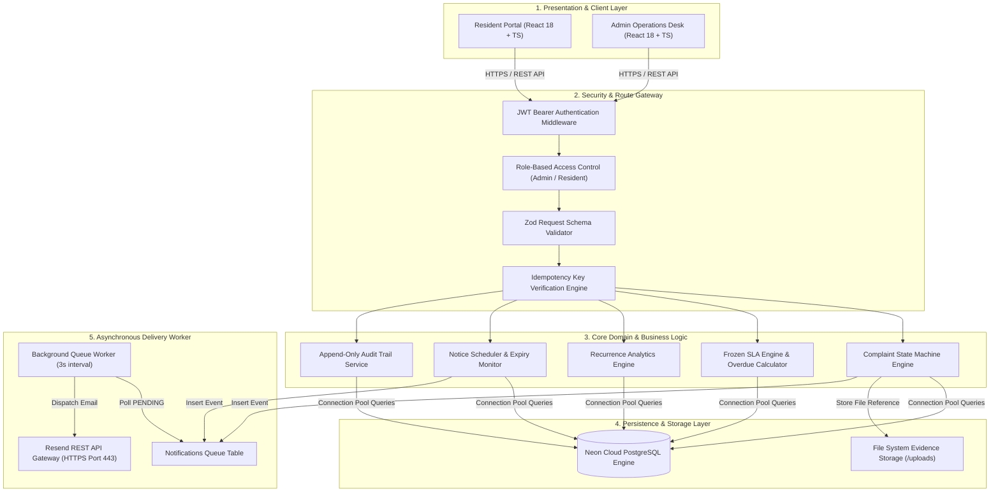
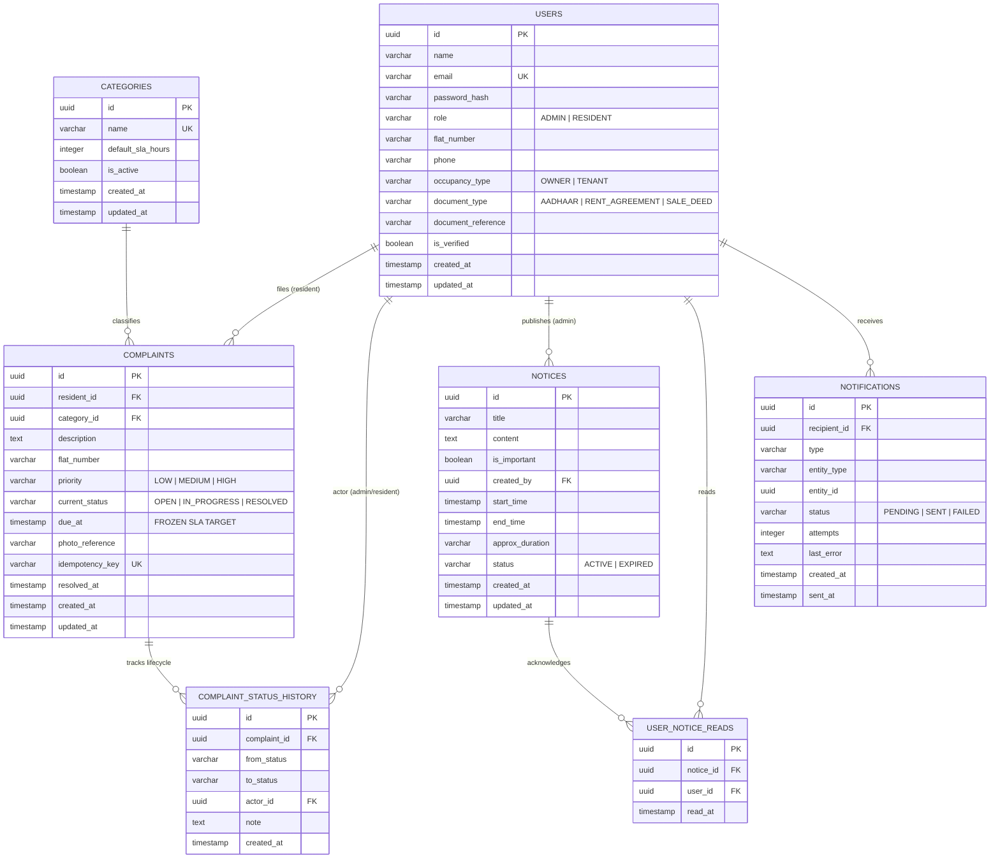
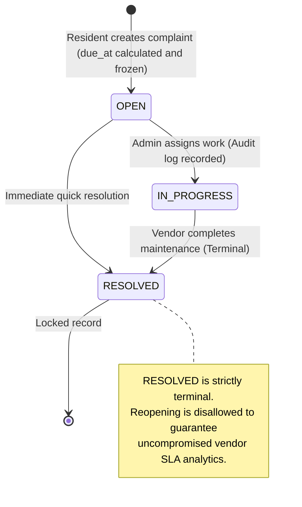
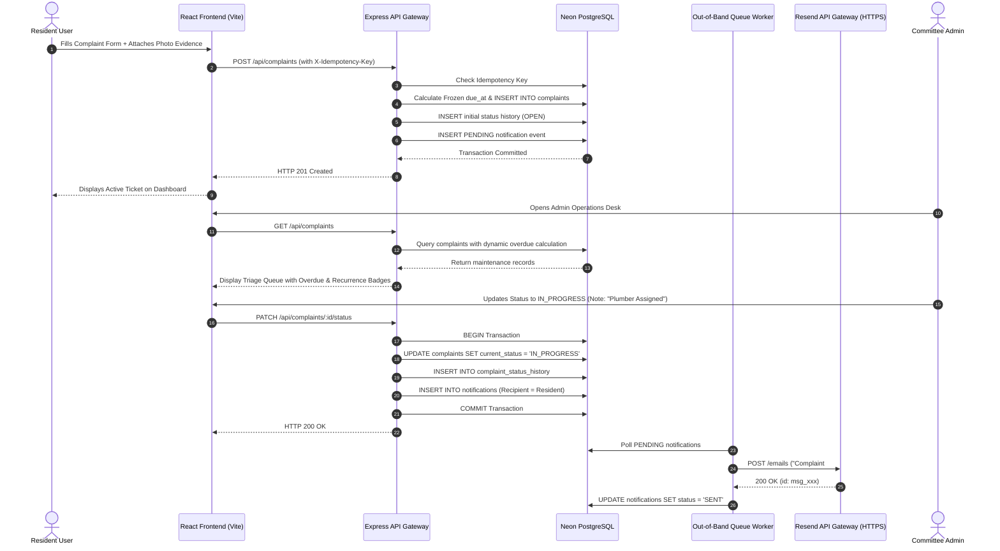

# ORQEN — System Architecture & Technical Design Specification

---

## 1. Executive Architecture Overview

ORQEN is an enterprise-grade residential operations platform built to solve asynchronous communication gaps and SLA tracking failures in apartment society maintenance. The system is designed with a **reliability-first, backend-authoritative architecture** ensuring data correctness, transactional state transitions, immutable auditability, and out-of-band communication resilience.

---

## 2. Database Schema & Entity Relationship Diagram (ERD)

---

## 3. Complaint Lifecycle & State Machine

The complaint state machine enforces strict, non-reversible transitions:

### Transition Matrix

| From Status | To Status | Allowed Actor | Trigger Action | Required Fields |
| :--- | :--- | :--- | :--- | :--- |
| `[None]` | `OPEN` | Resident | Files Complaint | `category_id`, `description`, `flat_number` |
| `OPEN` | `IN_PROGRESS` | Admin | Work Acknowledged | `note` (Audit Trail) |
| `OPEN` | `RESOLVED` | Admin | Quick Fix Completed | `note` (Audit Trail), sets `resolved_at` |
| `IN_PROGRESS` | `RESOLVED` | Admin | Task Completed | `note` (Audit Trail), sets `resolved_at` |
| `RESOLVED` | *Any* | *None* | **Prohibited** | Throws `400 INVALID_STATUS_TRANSITION` |

---

## 4. Frozen SLA & Dynamic Overdue Calculation

### Mathematical Model
Upon complaint submission at time $t_{\text{created}}$, the target resolution deadline $t_{\text{due}}$ is computed and frozen permanently:

$$t_{\text{due}} = t_{\text{created}} + \Delta t_{\text{category\_SLA}}$$

### Overdue Determination Logic
The overdue condition is evaluated dynamically across all query execution paths:

$$\text{is\_overdue}(C) = \begin{cases} 
\text{true} & \text{if } C.\text{status} \neq \text{'RESOLVED'} \land \text{now}() > C.\text{due\_at} \\
\text{false} & \text{otherwise}
\end{cases}$$

---

## 5. Sequence Diagram: Complaint Lifecycle & Real-Time Sync

---

## 6. Recurrence Detection Engine

To identify structural or persistent infrastructure defects, the platform computes repeat occurrences:

$$\text{Recurrence Count} = \sum \mathbf{1}_{\{ c \in \text{Complaints} \mid c.\text{flat} = F \land c.\text{category} = K \land c.\text{created\_at} \ge (\text{now}() - 30\text{ days}) \}}$$

When $\text{Recurrence Count} \ge 3$, the system raises a high-visibility **Recurrence Alert Badge** on the Admin Operations Desk to trigger root-cause preventive maintenance.

---

## 7. Role-Based Access Control (RBAC) Matrix

| Endpoint / Operation | Resident (Verified) | Resident (Unverified) | Committee Admin |
| :--- | :---: | :---: | :---: |
| `POST /api/complaints` | ✅ Allowed | ❌ Restricted (Must verify) | ❌ Restricted |
| `GET /api/complaints` | ✅ Own records only | ❌ Restricted | ✅ All Society Records |
| `PATCH /api/complaints/:id/status` | ❌ Restricted | ❌ Restricted | ✅ Allowed |
| `PATCH /api/complaints/:id/priority` | ❌ Restricted | ❌ Restricted | ✅ Allowed |
| `GET /api/auth/residents` | ❌ Restricted | ❌ Restricted | ✅ Allowed |
| `PATCH /api/auth/residents/:id/verify` | ❌ Restricted | ❌ Restricted | ✅ Allowed |
| `POST /api/notices` | ❌ Restricted | ❌ Restricted | ✅ Allowed |
| `GET /api/notices` | ✅ Allowed | ✅ Allowed | ✅ Allowed |
| `POST /api/notices/:id/acknowledge` | ✅ Allowed | ✅ Allowed | ✅ Allowed |

---

## 8. Out-of-Band Notification Architecture

1. **Transactional Insertion**: Notification records are inserted as `PENDING` within the primary database transaction.
2. **Decoupled Execution**: Dedicated background worker runs every 3 seconds to drain pending notifications.
3. **Fault Tolerance & Exponential Retries**: Transient API delivery failures increment the `attempts` counter up to 3 times before marking status `FAILED`, ensuring core operations APIs are never blocked.
